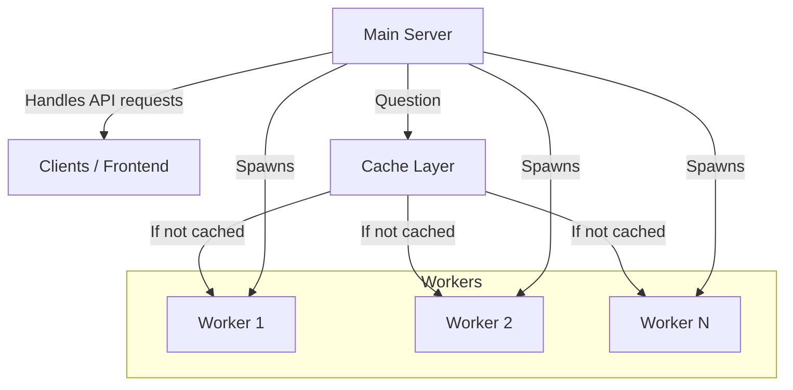
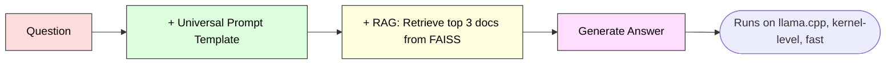
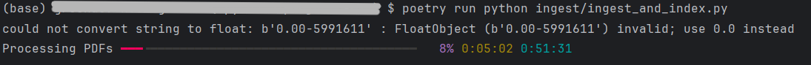

# Insight Bridge – Scalable LLM Inference Platform with End-to-End LLM Integration
<a href="https://creativecommons.org/licenses/by-nc-sa/4.0/">
  
</a>

**GitHub:** [ferdinand-koenig/insight-bridge](https://github.com/ferdinand-koenig/insight-bridge)  
**LinkedIn:** [ferdinand-koenig](https://www.linkedin.com/in/ferdinand-koenig)

## Overview

**Insight Bridge** is a semantic question-answering platform over complex documents using Retrieval-Augmented Generation (RAG), open-source Large Language Models (LLMs), and modern MLOps practices. It is a cloud-based platform for efficient, privacy-preserving LLM inference. The system dynamically spawns lightweight backend servers, handles requests asynchronously, and provides secure communication and smart caching.

This project demonstrates:

*   **End-to-End LLM Integration:** Efficient deployment of open-source LLMs with semantic retrieval and inference.
*   **Scalable Cloud Architecture:** Cost-aware auto-scaling infrastructure capable of handling potentially hundreds of concurrent users.
*   **Asynchronous & Future-Aware Design:** Robust async task management with caching that tracks hits/misses even across pending requests.
*   **Secure and Reliable Pipelines:** SSH/SSL-secured communication between instances and inference endpoints.

_Designed and implemented as a production-ready, state-of-the-art cloud solution._

## Features

### 1\. Async & Future-Aware Architecture

*   Backend instances run independently.
*   Handles multiple inference requests simultaneously.
*   Future-aware caching allows tasks to continue even if previous responses are still pending.

### 2\. Smart Caching

*   Feature-aware: caches responses based on input characteristics.
*   Reports cache hits and misses for monitoring and optimization.
*   Reduces redundant computation and improves response times.

### 3\. Secure Networking

*   **SSH tunneling** between main server and backend instances.
*   **HTTPS** for inference endpoints with TLS certificates.
*   All communication is private; no data leaves the cloud instances.

### 4\. Auto-Scaling & Cost Awareness

*   Dynamically adjusts backend pool size depending on load.
*   Cloud-cost-aware scaling: instances are spawned and terminated with economic efficiency in mind.
*   Supports scheduled shutdowns to minimize idle costs.

### 5\. Lightweight LLM Integration

*   Uses quantized models (e.g., `mistral-7b-instruct-v0.2.Q4_K_M`) for resource-efficient inference.
*   Runs entirely locally on CPU; no GPU required.
*   HTTP endpoints expose inference results while keeping privacy intact.
*   Integration of **FAISS** RAG with **LangChain** and **HuggingFace** models via **Llama.cpp** for CPU-optimized inference
*   CDLL (.so) linking for efficient backend model loading and correct Llama.cpp integration

## Project Info

*   **Tech Stack:** Python, LangChain, HuggingFace, FAISS, Llama.cpp, Custom Caching, Docker, Gradio
*   **Resource Efficient:** Small models run without GPU; longer responses expected.
*   **High Privacy:** Inference runs locally; input is not sent to third parties.
*   **Limitations:** Lower quality answers; fewer documents can be processed per request.
*   **Model:** mistral-7b-instruct-v0.2.Q4\_K\_M (Quantized to 4 Bit; 7B parameters)

## Disclaimer

This project is a **personal demo for portfolio purposes**. All input data is anonymous. The outputs of the LLM **do not represent personal statements** and may contain **inaccurate or misleading information**. They should not be relied upon for critical decisions.

## Career Note

I am currently seeking opportunities as an **ML Engineer / AI Researcher**. If you are interested in collaboration or hiring, please contact me via GitHub or LinkedIn.


## Project Overview

This project enables natural language Q&A on technical PDFs by:

- Ingesting and chunking documents  
- Generating semantic embeddings using SentenceTransformers  
- Storing embeddings in a FAISS vector store for fast retrieval  
- Integrating LLMs for answer generation  
- Packaging with Docker and adding monitoring for production readiness


## Tech Stack
> **TODO** Include here
Python, Pre-commit, fluff, ...

> Engineering Contributions
> - new Decorator that handles async and sync with future-aware caching (i.e., when one calculation is scheduled, the same is not restarted)
---

## High-level functionality and diagrams
### Cloud Architecture

One main server runs on minimal resources, handling the Frontend Webpage and
spawns new servers and destroys them if economically justified. See [Backend Spawn Decision](#backend-spawn-decision). 

In this project, a sophisticated cache was developed and employed that saves computations by
1) saving all request that are recently used and
2) if one calculation is already scheduled, all subsequent requests will wait instead of triggering new calculations.

### High-level inference

A worker gets the request via HTTP, which is not encrypted.
On the cloud solution, the HTTP endpoints are not made publicly available, but
rather only for the local host. For high security and privacy, an encrypted tunnel
is created via SSH to securely send HTTP traffic.

The Question is wrapped in a prompt template `prompt_template.yaml`.
It includes
```
You are an expert NLP researcher and QA Assistant for arXiv cs.CL preprints (NLP, LLMs), with knowledge up to June 2025.
  Using the context below, answer the question accurately and concisely in **your own words** [...]
```
Then, the question is transformed into a vector in a space. The closest `N` documents are retrieved,
because they are likely to be semantically relevant and added to the prompt as context.

The message containing of prompt template + context + question is sent to the LLM
running on efficient C++ code for fast inference on the CPU.

This saves cost in comparison to operations on GPUs which are the standard and
faster.

The answer is returned over HTTP.


### Indexing

Indexing is made once to create the RAG document store.
To add relevant documents, they are downloaded, chunked into
small pieces and transformed into vector-representation into a space.
These representations are saved into a database with metadata. Those
deliverables are provided to each worker.


## Setup


### Inference only with Docker container
#### Requirements
- Docker

#### Steps
```bash
docker run -it --rm \
  -v .\model\:/model/ \
  -v .\config.yaml:/insight-bridge/config.yaml \
  -v .\prompt_template.yaml:/insight-bridge/prompt_template.yaml \
  [-v .\app:/insight-bridge/app \]
  [-v .\dev_data\dummy_response.html:/insight-bridge/dev_data/dummy_response.html \]
  -p 7860:7860 \
  --entrypoint python3 \
  insight-bridge \
  -m app.main
  ```

* `-v /path/on/host/model.bin:/app/models/model.bin`  
  Mounts the model file from your host machine into the container at `/app/models/model.bin` (adjust paths as needed)
  
* `-p 7860:7860`  
  Maps the container port 7860 to your host, if your app serves on that port
  
* `--rm`  
  Automatically removes the container when it stops
  
* `-it`  
  Runs the container with an interactive terminal

Windows Terminals (PS, CMD) usually can't handle linebreaks in commands. Use one line:

E.g.,
```bash
docker run -it --rm -v .\model\tinyllama-1.1b-chat-v1.0.Q4_K_M.gguf:/insight-bridge/models/tinyllama-1.1b-chat-v1.0.Q4_K_M.gguf -v .\config.yaml:/insight-bridge/config.yaml -p 7860:7860 --entrypoint python3 insight-bridge -m app.main
```


#### Development with Docker
To build a new build, use
```bash
docker buildx bake
```
This will build `insight-bridge-server:latest` and `insight-bridge-worker:latest`.

Run with following command to also copy the `app` directory for continuous development.
```bash
docker run -it --rm -v .\model\phi-2.Q4_K_M.gguf:/model/phi-2.Q4_K_M.gguf -v .\config.yaml:/insight-bridge/config.yaml -v .\app:/insight-bridge/app -p 7860:7860 --entrypoint python3 insight-bridge -m app.main
```


### Local installation
#### Requirements

- Python 3.10 (>=3.10, <4.0)  
- Poetry for dependency management

#### Steps
1. Clone the repository

   ```bash
   git clone <your-repo-url>
   cd insight-bridge
    ```
	
2. Install dependencies
   1. Example for ingest (For processing documents for RAG)
      ```bash
      python install.py ingest
      ```
      >    **Note**  
      >    On Ubuntu and other Linux distributions, you may need to run `python3 install.py` instead of `python install.py`.  
      >    Ensure [Poetry](https://python-poetry.org/docs/#installation) is installed and available in your PATH.

      >    **For inference**, the Docker container is advised.
   2. General explanation
      ```bash
      python install.py <keywords>
      ```
      There are three keywords possible:
    
      | Keyword | Description | Includes                                                                                                             |
        | --- | --- |----------------------------------------------------------------------------------------------------------------------|
        | _(none)_ | Base dependencies always installed | `pyyaml`, `rich`                                                                                                     |
        | `core` | Shared optional dependencies used in both ingest and inference | `langchain`, `faiss-cpu`, `sentence-transformers`, `huggingface-hub`, `langchain-community`, `langchain-huggingface` |
        | `ingest` | Ingestion-only dependencies for downloading, parsing, and indexing documents | `requests`, `feedparser`, `pypdf`, `simpleeval` + **core**                                                           |
        | `inference` | Heavy ML dependencies for running models and embeddings | `torch`, `transformers`, `hf-xet`, `accelerate`, `llama-cpp-python` + **core**                                       |
        | `dev` | Developer tooling for linting, formatting, and pre-commit hooks | `pre-commit`, `ruff`                                                                                                 |
       >    The installer automatically includes the `core` group which is a shared group for LLM related workflows
       >    (`ingest` and `inference`)

3. [Development only] Install pre-commit 
    ```bash
   poetry run pre-commit install
    ```
   Enforces code standard. Requires to install `dev` group in prev. step.
	
4. [Ingest only] Prepare your document folder

    Place PDF documents inside the `data/raw/` directory.


#### Usage

To run the document ingestion and indexing pipeline:
	```bash
	poetry run python ingest/ingest_and_index.py
	```
	
This will:

- Load PDFs from data/raw/

- Chunk documents into overlapping pieces

- Generate embeddings with SentenceTransformers

- Store embeddings in a FAISS index (data/faiss_index)

- Save chunk metadata for source tracking (data/faiss_metadata.pkl)

Look and feel:



## Project Structure

	```
	.
    ├── app/                         # Core application code
    │   ├── inference/               # LLM inference pipelines and worker server
    │   ├── llm_worker_provisioners/ # Worker provisioners (local, Hetzner, base)
    │   └── server/                  # Backend server, caching, HTML resources
    ├── ingest/                      # Scripts to download, ingest, and index datasets
    ├── data/                        # Generated data (FAISS indexes, metadata)
    │   ├── raw/                      # Original PDFs, not committed due to copyright
    │   ├── FAIS-1k-150/              # FAISS index subset, not committed due to size
    │   ├── FAIS-700-100/             # FAISS index subset, not committed due to size
    │   └── faiss_index               # Main index files, not committed due to size
    ├── model/                       # Pretrained model files (GGUF, etc.)
    │                                 # Not committed; should be downloaded/linked as described
    ├── logs/                        # Application runtime logs
    │                                 # Not committed; local only
    ├── prompt-library/              # YAML prompt templates for various models
    ├── images/                      # Images for documentation/README
    ├── .dockerignore                 # Docker ignore patterns
    ├── Dockerfile                    # Docker image definition
    ├── docker-bake.hcl               # Multi-stage Docker build configuration
    ├── install.py                    # Installation helper script
    ├── pyproject.toml                # Poetry project configuration
    ├── poetry.lock                   # Locked dependencies
    ├── LICENSE                       # Project license
    ├── README.md                     # This file
    ├── prompt_template.yaml           # Core prompt templates
    └── config.yaml                   # Global configuration
	```

### Notes

- **data/**: Generated via `ingest/`. Subfolders shown for structure; contents not committed due to copyright and repository size.  
- **model/**: Pretrained models not included; download/link as described in installation instructions.  
- **logs/**: Local runtime logs; not pushed.  
- **images/**: Documentation only (e.g., README screenshots).  
- **prompt_template.yaml**: Committed; contains prompt template (*Prompt Engineering*).  
- **Docker & installation files**: `.dockerignore`, `Dockerfile`, `docker-bake.hcl`, `install.py` help with setup and containerization.


	
## Roadmap
- Week 1: Document ingestion, chunking, embedding, and vector indexing (current)

- Week 2: Build retrieval and LLM pipeline for answer generation

- Week 3: Containerize app, build API/UI, add CI/CD

- Week 4: Add MLOps monitoring, evaluation, and polish

## Contact
Ferdinand Koenig

ferdinand -at- koenix.de

## Appendix

### Backend Spawn Decision
Situation: No idling backend available.

Problem: Should we wait for completion or spawn a new backend to achieve the fastest computation?

Let:

- $Q$ = number of queued requests  
- $B$ = number of busy backends  
- $t_i$ = average inference time per request  
- $t_s$ = average startup time for a new backend  

#### 1. Estimated wait if we do NOT spawn a new backend

Since each backend can process requests in parallel, the first queued request will roughly wait for:

$W_{\text{no\_spawn}} = t_i \cdot \Big(\lceil Q / B \rceil + 1\Big)$


- $\lceil Q / B \rceil$ estimates how many "rounds" of inference are required for queued requests to reach an available backend.  
- $+1$ accounts for the inference time of the first queued request itself.  

#### 2. Estimated wait if we spawn a new backend

The total time includes both startup and inference:

$W_{\text{spawn}} = t_s + t_i$

- The first request can only start processing after the backend has fully started.

#### 3. Spawn decision

$\text{spawn_new_backend} =
\begin{cases} 
\text{True} & \text{if } W_{\text{no\_spawn}} > W_{\text{spawn}} \\
\text{False} & \text{otherwise} 
\end{cases}$

This captures the **economic trade-off**: spawn a new backend only if doing so will reduce the expected wait for queued requests.


### HetznerProvisioner Setup Instructions

1.  **Create a Hetzner Cloud API token:**
    *   Go to Hetzner Console → Security → API Tokens
    *   Copy the token for use in this provisioner.
2.  **Create an SSH key:**
    *   Generate a key pair on your main server:
        
        ```
        ssh-keygen -t rsa -b 4096 -f ~/.ssh/hetzner_key
        ```
        
    *   Add the public key in Hetzner Console → SSH Keys
    *   Use the private key path on the main server for Paramiko connections
3.  **Prepare a snapshot with preloaded model:**
    *   Launch a Hetzner server manually and install your LLM container/model
    *   Shut down the server and create a snapshot via Hetzner Console → Snapshots → Create Snapshot
    *   Use this snapshot name when initializing HetznerProvisioner(snapshot\_name="your-snapshot-name", ...)
4.  **Main server setup:**
    *   Ensure the main server running BackendPool has read access to the private SSH key
    *   Paramiko will use this key to securely connect to spawned VPS instances
5.  **Security:**
    *   Use only SSH key authentication, do not enable password authentication
    *   Allow SSH access only from the main server; do not expose unnecessary ports
6.  **Integration:**
    *   Instantiate the BackendPool singleton with HetznerProvisioner
    *   Each request spawns or allocates a VPS, runs inference via SSH, then releases the backend

### Dev notes
#### If poetry env installation jams
```bash
peotry env remove python
poetry env use python3.10

```